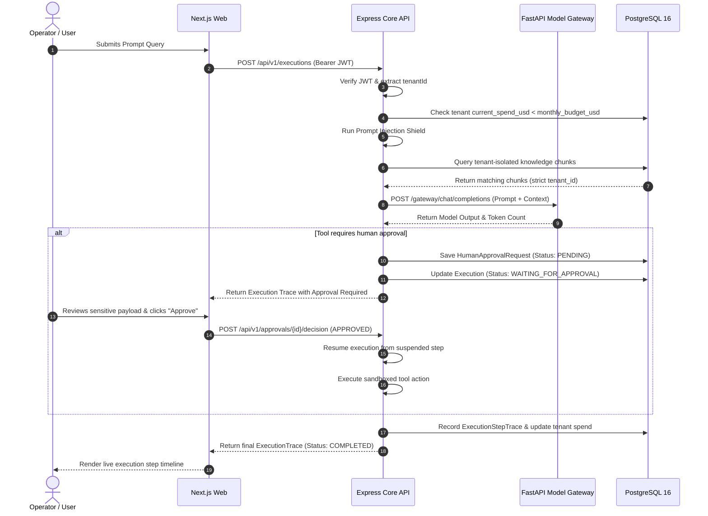

# AgentSphere End-to-End Data Flow

## 1. Complete Request Lifecycle (Browser → Database → Browser)

```mermaid
sequenceDiagram
    autonumber
    actor User as Operator / User
    participant Web as Next.js Web
    participant Core as Express Core API
    participant Py as FastAPI Model Gateway
    participant DB as PostgreSQL 16

    User->>Web: Submits Prompt Query
    Web->>Core: POST /api/v1/executions (Bearer JWT)
    Core->>Core: Verify JWT & extract tenantId
    Core->>DB: Check tenant current_spend_usd < monthly_budget_usd
    Core->>Core: Run Prompt Injection Shield
    Core->>DB: Query tenant-isolated knowledge chunks
    DB-->>Core: Return matching chunks (strict tenant_id)
    Core->>Py: POST /gateway/chat/completions (Prompt + Context)
    Py-->>Core: Return Model Output & Token Count
    alt Tool requires human approval
        Core->>DB: Save HumanApprovalRequest (Status: PENDING)
        Core->>DB: Update Execution (Status: WAITING_FOR_APPROVAL)
        Core-->>Web: Return Execution Trace with Approval Required
        User->>Web: Reviews sensitive payload & clicks "Approve"
        Web->>Core: POST /api/v1/approvals/{id}/decision (APPROVED)
        Core->>Core: Resume execution from suspended step
        Core->>Core: Execute sandboxed tool action
    end
    Core->>DB: Record ExecutionStepTrace & update tenant spend
    Core-->>Web: Return final ExecutionTrace (Status: COMPLETED)
    Web-->>User: Render live execution step timeline
```
