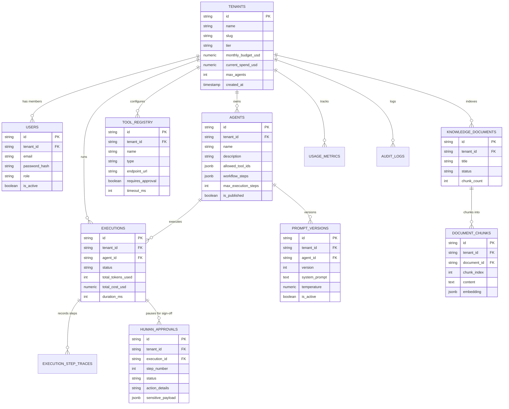

# AgentSphere Database Entity-Relationship (ER) Diagram

```mermaid
erDiagram
    TENANTS ||--o{ USERS : "has members"
    TENANTS ||--o{ AGENTS : "owns"
    TENANTS ||--o{ TOOL_REGISTRY : "configures"
    TENANTS ||--o{ KNOWLEDGE_DOCUMENTS : "indexes"
    TENANTS ||--o{ EXECUTIONS : "runs"
    TENANTS ||--o{ USAGE_METRICS : "tracks"
    TENANTS ||--o{ AUDIT_LOGS : "logs"

    AGENTS ||--o{ PROMPT_VERSIONS : "versions"
    AGENTS ||--o{ EXECUTIONS : "executes"

    KNOWLEDGE_DOCUMENTS ||--o{ DOCUMENT_CHUNKS : "chunks into"

    EXECUTIONS ||--o{ EXECUTION_STEP_TRACES : "records steps"
    EXECUTIONS ||--o{ HUMAN_APPROVALS : "pauses for sign-off"

    TENANTS {
        string id PK
        string name
        string slug
        string tier
        numeric monthly_budget_usd
        numeric current_spend_usd
        int max_agents
        timestamp created_at
    }

    USERS {
        string id PK
        string tenant_id FK
        string email
        string password_hash
        string role
        boolean is_active
    }

    AGENTS {
        string id PK
        string tenant_id FK
        string name
        string description
        jsonb allowed_tool_ids
        jsonb workflow_steps
        int max_execution_steps
        boolean is_published
    }

    PROMPT_VERSIONS {
        string id PK
        string tenant_id FK
        string agent_id FK
        int version
        text system_prompt
        numeric temperature
        boolean is_active
    }

    TOOL_REGISTRY {
        string id PK
        string tenant_id FK
        string name
        string type
        string endpoint_url
        boolean requires_approval
        int timeout_ms
    }

    KNOWLEDGE_DOCUMENTS {
        string id PK
        string tenant_id FK
        string title
        string status
        int chunk_count
    }

    DOCUMENT_CHUNKS {
        string id PK
        string tenant_id FK
        string document_id FK
        int chunk_index
        text content
        jsonb embedding
    }

    EXECUTIONS {
        string id PK
        string tenant_id FK
        string agent_id FK
        string status
        int total_tokens_used
        numeric total_cost_usd
        int duration_ms
    }

    HUMAN_APPROVALS {
        string id PK
        string tenant_id FK
        string execution_id FK
        int step_number
        string status
        string action_details
        jsonb sensitive_payload
    }
```
